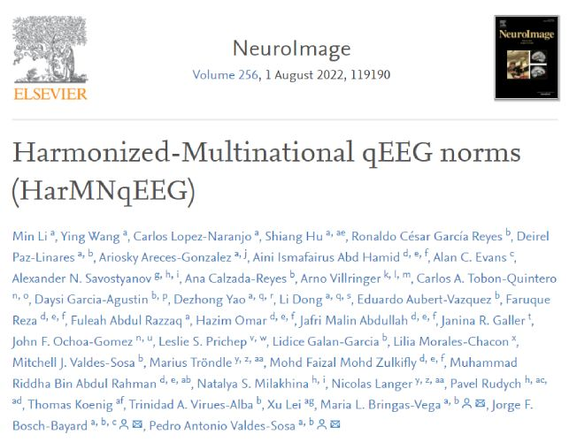
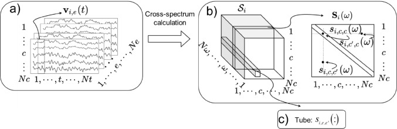
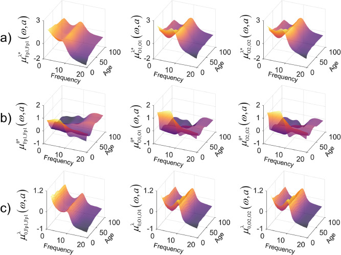

# HarMNqEEG Toolbox
<h3>Global EEG Normative Project</h3>

    Original code Author: Ying Wang, Min Li
    Cbrain Tool Author:   Eng. Tania Perez Ramirez <tperezdevelopment@gmail.com>
    Copyright(c):         2022 Ying Wang, yingwangrigel@gmail.com, Min Li, minli.231314@gmail.com                          
    Joint China-Cuba LAB, UESTC, CNEURO (Cuban Center for Neurosciences)

<h2 dir="auto">Reference Paper</h2>

    

doi:<a href="https://doi.org/10.1016/j.neuroimage.2022.119190" target="_blank">10.1016/j.neuroimage.2022.119190</a>.
Epub 2022 Apr 7. PMID: 35398285.

<h2 dir="auto">HarMNqEEG Toolbox Description</h2>

This toolbox extends frequency domain quantitative electroencephalography (qEEG) methods pursuing higher sensitivity to detect Brain Developmental Disorders. Prior qEEG work lacked integration of cross-spectral information omitting important functional connectivity descriptors. Lack of geographical diversity precluded accounting for site-specific variance, increasing qEEG nuisance variance. We ameliorate these weaknesses by (i) Creating lifespan Riemannian multinational qEEG norms for cross-spectral tensors. These norms result from the HarMNqEEG project fostered by the Global Brain Consortium. We calculated the norms with data from 9 countries, 12 devices, and 14 studies, including 1564 subjects. Developmental equations for the mean and standard deviation of qEEG traditional and Riemannian DPs were calculated using additive mixed-effects models. We demonstrate qEEG “batch effects” and provide methods to calculate harmonized z-scores. (ii) We also show that harmonized Riemannian norms produce z-scores with increased diagnostic accuracy. These results contribute to developing bias-free, low-cost neuroimaging technologies applicable in various health settings. In this first version, we limited the harmonized qEEG to the 19 channels of the S1020 montage.
At the present, the toolbox accepts the input EEG data in EEG-BIDS, EDF+, BDF+, PLG, EEGLAB SET format, and a predefined TEXT format. In the case of not EEG-BIDS structure, the derivatives are stored in the same directory where the raw EEG file is located.
The toolbox also contains the definition of the Harmonized qEEG derivatives for the EEG-BIDS format. The derivatives are stored in the BIDS structure compliant with the BIDS definition for the derivatives, in the Hierarchical Data Format (HDF). The functions for creating and loading the HarMNqEEG derivatives can be found in the directory "derivatives_functions".

<h2 dir="auto">HarMNqEEG Toolbox Installation and Requirements</h2>
<ol dir="auto">
<li>Matlab version: 2021b</li>
<li> Clone the repository or download the .zip folder. </li>
<li> Unzip the folder and Add the HarMNqEEG folder to your path in MATLAB.</li>
<li> Call the main function HarMNqEEG_main.m.</li>
</ol>

<h2 dir="auto">HarMNqEEG Toolbox Example</h2>

In the folder example_data, there are two subfolders and the test_HarMNqEEG.m file to run the tool with data example.

<ul>
  <li>Subfolder: with_cross_spectra_generated. This folder will be the raw_data_path parameter. This folder contains 2 subjects by folder for testing the tool. In each subject folder there is a .mat file with the <strong>cross spectra generated</strong>. When the raw_data_path parameters is the results of the data_gatherer ( Github location of the script: https://github.com/CCC-members/BC-V_group_stat/blob/master/data_gatherer.m), the generate_cross_spectra parameter must be 0. </li>
  <li>Subfolder: without_the_cross_spectra_generated. This folder will be the raw_data_path parameter. This folder contains 2 subjects by folder for testing the tool. In each subject folder there is a .mat file with the <strong>cross spectra input data</strong>. The generate_cross_spectra parameter must be 1. </li>
  <li>Subfolder: raw_data. This folder contain different formats: BIDS, .set, .plg, .txt. For run this data, you must select as subjects_metadata parameter the file <strong>raw_data_table.tsv</strong> or <strong>raw_data_table.mat</strong>.</li>
</ul>

<h2>HarMNqEEG Cbrain Plugin and Docker Image</h2>
<h4>Note important</h4>

This is the matlab code to develop the Cbrain plugin. That's why it doesn't  have a graphical interface. In example_data folder you have an example script.

<ol dir="auto">
<li><a target="_blank" href="https://github.com/tperezdevelopment/cbrain_plugins/blob/main/boutiques_descriptors/HarMNqEEG.json">HarMNqEEG.json</a></li>
<li><a  target="_blank "href="https://hub.docker.com/repository/docker/tperezdevelopment90/harmnqeeg">HarMNqEEG docker image</a></li>
</ol>

<h2 dir="auto">Input Parameters:</h2>
<h4>Note important</h4>

The chanel montage must be 10-20 system

<h4>Data Gatherer</h4>
<ul>
<li>generate_cross_spectra: Boolean parameter. Default False. Case False (0), the raw_data_path folder will contain the data_gatherer output. Case True (1) is required to calculate the cross spectra.</li>
<li>raw_data_path : This parameter is required. Folder path of the raw data. The content of this raw_data_path depends of generate_cross_spectra parameters:
                  <ul style="list-style: none">
                    <li>1- If the generate_cross_spectra is False (0), this folder must be contain the data_gatherer output, with the cross spectra generated.
                       (See more: <a href="https://github.com/CCC-members/BC-V_group_stat/blob/master/data_gatherer.m" target="_blank">https://github.com/CCC-members/BC-V_group_stat/blob/master/data_gatherer.m</a>)
                    </li>
                    <li>2- If the generate_cross_spectra is True (1), the raw_data_path can contain the following formats:
                    <ul style="list-style: none">
                    <li>2.1- A Matlab structure (*.mat) with the following parameters:
                        <ul style="list-style: none">
                        <li> - data : an artifact-free EEG scalp data matrix, organized as nd x nt x ne, where
                         <ul style="list-style: none">
                             <li>nd : number of channels</li>
                            <li>nt : epoch size (# of instants of times in an epoch)</li>
                            <li>ne : number of epochs</li>
                        </ul>
                        </li>    
                        <li> - sampling_freq : sampling frequency in Hz. Eg: 200</li>
                       <li> - cnames : a cell array containing the names of the channels. The expected names are:
                       <ul style="list-style: none">
                         <li> 'Fp1'    'Fp2'    'F3'    'F4'    'C3'    'C4'    'P3'    'P4'    'O1'    'O2'    'F7'    'F8'    'T3'    'T4'    'T5'    'T6'    'Fz'    'Cz'    'Pz'</li>
                        </ul>
                           If the channels come in another order, they are re-arranged according to the expected order
                        </li>
                       <li> - data_code : is the name of the original data file just for purpose of identification.</li>
                        <li> - reference : a string containing the name of the reference of the data.</li>
                        <li> - age : subject's age at recording time</li>
                        <li> - sex : subject's sex</li>
                        <li> - country : country providing the data</li>
                        <li>- eeg_device : EEG hardware where the data was recorded</li>
                        </ul> </li>
                    <li>2.2- An ASCII file (*.txt) with a fixed structure which contains the data of an EEG file. In that case, the file needs to have the extension ".txt" and must have the following structure:
                    <ul style="list-style: none">
                        <li>- NAME</li>     
                        <li>- SEX</li>
                        <li>- AGE</li>
                        <li>- SAMPLING_FREQ</li>
                        <li>- EPOCH_SIZE</li>
                        <li>- NCHANNELS</li>
                        <li> - MONTAGE=
                            <ul style="list-style: none;">
                              <li> Fp1-REF</li>
                              <li> Fp2-REF</li>
                              <li> F3_-REF</li>
                            </ul> 
                           and so on. The program expects NCHANNELS lines with the names
                        </li>
                        <li> AFTER THE CHANNELS NAMES THE EEG DATA where each lione is an instant of time and each column represents a channel. If the EEG contains 30 segments of 512 points each and 19 channels, then 30*512 lines of 19 columns of numbers (either float or integer) are expected</li>
                        <li> 2.3- Generic data formats (*.edf)</li>
                        <li> 2.4- Biosemi (*.bdf)</li>
                        <li> 2.5- EEGLAB format (*.set)</li>
                        <li>  2.6- MEDICID neurometrics system (*.plg)</li>

</ul>
                     </li>
                    </ul>

</ul>

</li>

</ul>								

<h4>Metadata</h4>
<ul>
   <li>subjects_metadata: This files is optional in case generate_cross_spectra is False (0) In case generate_cross_spectra is True this must be a  *.csv, *.tsv or *.mat file format. This file must contain a list of subjects with the following metadata info:
     <ul style="list-style: none">
        <li>1- data_code: Name of the file subject or the subfolder subject listed  in raw_data_path folder. Required metadata</li>
        <li>2- reference: A string containing the name of the reference of the data. Required metadata</li>
        <li>3- age: Subject's age at recording time. Required metadata</li>
        <li>4- sex: Subject's sex. Optional metadata</li>
        <li>5- country: Country providing the data. Required metadata</li>
        <li>6- eeg_device: EEG hardware where the data was recorded. Required metadata</li>
    </ul>
  </li>
</ul>

<h4>Preproccess Guassianize Data and  Calculate z-scores and harmonize </h4>
<ul> <li>typeLog: This parameter is required. Type of gaussianize method to apply.   
										<strong>Options:</strong> 
                                   <ul><li> typeLog(1): for log (Boolean). By default is False:  log-spectrum.</li>
                                    <li>typeLog(2): for riemlogm (Boolean). By default is True: cross-spectrum with Riemannian Vectorization.</li></ul>
</li>
<li>batch_correction --> List of the batch correction. You must select one closed study for calculating batch harmonized z-scores. The batch_correction you can put the number of the batch list or the batch correction name.   
				     <strong>The name of existed batch reference is the union between: EEG_Device+Country+Study_Year:</strong> 
		<ul>			 
                    <li> 1:  ANT_Neuro-Malaysia</li>
                    <li> 2:  BrainAmp_DC-Chengdu_2014</li>
                    <li> 3:  BrainAmp_MR_plus_64C-Chongqing</li>
                    <li> 4:  BrainAmp_MR_plus-Germany_2013</li>
                    <li> 5:  DEDAAS Barbados1978</li>
                    <li> 6:  DEDAAS-NewYork_1970s</li>
                    <li> 7:  EGI-256 HCGSN_Zurich(2017)-Swiss</li>
                    <li> 8:  Medicid-3M Cuba1990</li>
                    <li> 9:  Medicid-4 Cuba2003</li>
                    <li> 10: Medicid_128Ch-CHBMP</li>
                    <li> 11: NihonKohden-Bern(1980)_Swiss</li>
                    <li> 12: actiCHamp_Russia_2013</li>
                    <li> 13: Neuroscan_synamps_2-Colombia</li>
                    <li> 14: nvx136-Russia(2013)</li>
	   </ul>							
</li>
</ul>

<h4>Optional Matrices to save </h4>
<ul>
<li>optional_matrix: List of matrix optional that the user can select.  
                    <strong>Options:</strong> 
      <ul style="list-style: none">
        <li>optional_matrix(1):  FFT_coefs (Boolean):  Complex matrix of FFT coefficients of nd x nfreqs x epoch length</li>
        <li>optional_matrix(2): Mean_Age_Cross (Boolean): Mean for Age of Tangent Space Cross Spectra Norm</li>
     </ul>       
</li>
</ul>		

<h4>Auxiliar inputs</h4>
<ul>
<li>outputFolder_path: Path of output folder</li>
</ul>

<h2 dir="auto">HarMNqEEG Toolbox Output Description</h2>
<strong>Folder structure</strong> 
The tool will save a subfolder 'derivatives' (following the struct BIDs, https://bids.neuroimaging.io/) into the folder defined by the user with the outputFolder_path parameter. Into the subfolder derivatives, the result will save by each folder subject.  
<strong>Type of output files</strong> 
Into each folder subject (data_code) will be saved three files: 1-log_[data_code] file, 2- HarMNqeeg_derivatives_[data_code].json and 3- HarMNqeeg_derivatives_[data_code].h5. The .h5 file is a hdf5 format. HDF5 is a data model, library, and file format for storing and managing data (More info: https://portal.hdfgroup.org/display/HDF5/HDF5). The two files will saved commun values like the name of the tool, description, and other metas info. Also will be saved attributes and matrix description 
<ol>
   <li>Name_Subject: name of the subject</li>
   <li>Country: of the subject</li>
   <li>EEGMachine: EEG device with which the study was carried out</li>
   <li>Sex: sex of the subject</li>
   <li>Age: age of the subject</li>
   <li>MinFreq: Minimum spectral frequency (according to the data recording maybe down-sampled if higher than the expected, or the original one if lower than the expected)</li>
   <li>FreqRes: Frequency resolution (maybe down-sampled if higher than the expected, or the original one if lower than the expected)</li>
   <li>MaxFreq: Maximum spectral frequency (according to the data recording maybe down-sampled if higher than the expected, or the original one if lower than the expected) </li>
   <li>Epoch_Length: Epoch size (# of instants of times in an epoch)</li>  
   <li>reRefBatch: In case of the batch_correction is not empty. The reRefBatch is the batch correction of the z-scores</li>
</ol>

Also the HarMNqeeg_derivatives.h5 will be saved the following matrix:

<h4>In case typeLog(1)-> for log = True </h4>
<ol>

   <li>Raw_Log_Spectra: Raw Log-spectra matrix, after average reference and GSF (Global Scale Factor) correction. Each row is a frequency. The value of the frequency is in the field Freq.</li>
   <li>Harmonized_Log_Spectra: Harmonized log raw spectrum average reference and corrected by the GSF, harmonized by the correction of the given batch.</li>
   <li>Z_scores_Log_Spectra: The Z-scores of an individual raw Spectra. The element (i, f) of this matrix represents the deviation from normality of the power spectral density (PSD) of channel i and frequency f. The raw spectra is transformed to the Log space to achieve quasi gaussian distribution.</li>
   <li>Harmonized_Z_scores_Log_Spectra: Harmonized Z-score of the log raw spectrum average reference and corrected by the GSF, harmonized by the correction of the given batch.</li>
</ol>   

<h4>In case typeLog(2)-> for riemlogm = True </h4>
<ol>
    <li>Raw_TangentSpace_Cross_Spectra: Raw Cross-spectral matrix transformed to the Tangent space.</li>
   <li>Harmonized_Raw_TangentSpace_Cross_Spectra: Harmonized Raw Cross-spectral matrix transformed to the Tangent space.</li>
   <li>Z_scores_TangentSpace_Cross_Spectra: Z-scores of the Cross-spectral matrix transformed to the Tangent space.</li>
   <li>Harmonized_Z_scores_TangentSpace_Cross_Spectra: Harmonized Z-scores of the Cross-spectral matrix transformed to the Tangent space.</li>   
</ol>

<h4>In case optional_matrix(1) = True </h4>
<ol>
   <li>FFT_coefs:  Complex matrix of FFT coefficients of nd x nfreqs x epoch length (stored for possible needed further processing for calculating the cross-spectral matrix, like regularization algorithms in case of ill-conditioning).</li>
</ol>

<h4> In case optional_matrix(2) = True</h4>
<ol>
   <li>Mean_for_Age_of_TangentSpace_Cross_Spectra_Norm: Mean for Age of Tangent Space Cross Spectra Norm.</li>
</ol>

